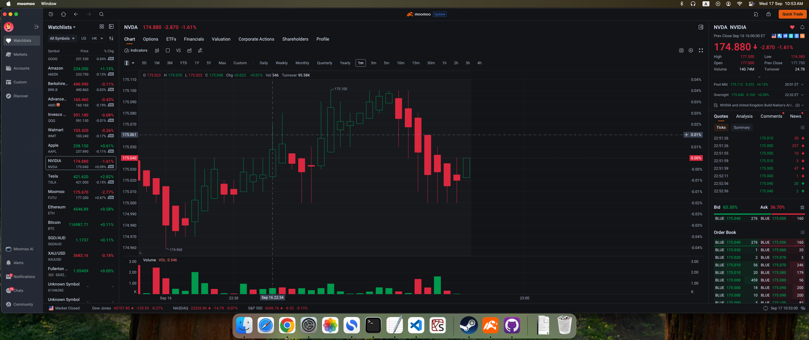

 # GPLLMA: General Purpose LLM Assistant.

## Introduction
Chatgpt is very good at understanding images and this feature can be exploited to perform guidance in complex situations. 

For example, in trading, traders often interpret candlestick charts visually. Traders use a method called technical analysis which is complicated (involves many complicated patterns and measures) and highly subjective, and can lead to losses if inaccurate. Many traders, and especially beginners also have very little knowledge of technical analysis. One way is to rely (at your own peril) on chatgpt to analyse the candlestick graphs and provide trading advice. In this case, the LLM assistant can be deployed in which it will analyse the stock chart when it detects a change and output its analysis in text form and provide guidance to the trader. 

Beyond trading, this is a general purpose method and can be used for other scenarios that require LLM assistance.

The prompt can be easily customized for different contexts/problems.




Set up:
```bash
conda create -n assistant python=3.12
pip install -r requirements.txt
```

Setup openai api key:
```bash
export OPENAI_API_KEY="sk-your_api_key_here"
```

Run:
```bash
cd main
python chatgpt_assistant.py
```
